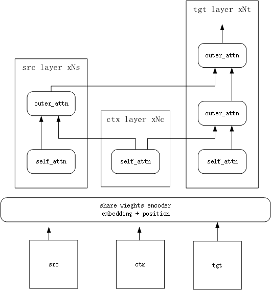

# ContextTransformer
A PyTorch implementation of ContextTransformer for Question and Answer.


## Dependencies
- Python 3.x
- PyTorch >= 0.4 
- tqdm
- numpy

## Dependencies
PyTorch 1.0.0  win，超过1有问题
gtx 1060 战神笔记本


## Dataset
https://github.com/gsh199449/productqa

## Quick Start
* scripts/jdc.py
组装数据源

* vocab.py 
```
文件分词 生成词汇表
```

* get_data.py
 划分训练集 划分问答背景

* retrive 
检索答案


* main_train.py
```
模型训练
```

* main_test.py
```
模型测试
```

## References
https://github.com/siat-nlp/transformer-pytorch

## 更新记录

从头再来
1.变量直接注入命令行参数  大批次可能钝化
2.训练十万行
3.json保存
4.read began end  
5.保存中间模型，多候选输出
6.字典排序，产生frequency
7.抽象Util
8.预处理划分训练集函数,不洗牌
9. .read().splitlines()
10.优化read()代码
11.分词函数, 废弃过短
12. get_pair通用化
13. json保存词汇表  二进制保存训练数据
14.实验qa 大词表 收敛慢
15.实验平衡混合数据
16.移除生词
17.抽象digitlize,直接从文本序列化
18.Util中topk
19.训练集抽取topk，过拟合；一般纪律抽取有奇效 
20.clip
21.京东语料库清洗
22.字母组词，数字组词
23.读取src,ctx, tgt
24.环境相关模块
ctx_encoder  ctx_ebmed->自注意力+ffn
src+ctx多头注意力
tgt+ctx多头+src多头
25.可以正常预测。解决test 不等长,附近的变量名称看错了。。
26.放弃门控制,下两步改用高底层搭配
27.前三层使用自注意力编码器，ctx_encoder
28.检索功能
29.抑制废话，建立废词表
30.优化了逐行读取
31:json->review1_json
32:背景信息=name+cate 3,2,1
33:只截取带空格50长度的样本输入，问答平均27，取序列长20
34.不能成句。截取5-80长度
35.循环学习率 无效
36.37版本回滚至34版本，此后git，测试通过后发布。为适应git训练测试数据外置，预处理暂未处理。只有模型过大上传不了。
37.添加组件后太慢，一定几率使用context_encoder,share_encoder。有可能不收敛，开始不要加。之后概率逐渐加大。
38.简化了装载模型步骤，下一步抽象 【失败】 不知为何 初始化对象的参数自动转成元组·
39.抽象teacher force 用 decoder
40.beam_search 移除EOS 
41.decode函数，生成decoder_input  输入 ctx_idx src_idx 输出 tgt_idx
42.共享权重给改为共用词嵌入层  共享权重有效 共用嵌入层更快，续接有效，初始化无效
43.整个批次做teacher force可能会带偏，选取三条。
44.vocab太麻烦，重写
45.数据胜于模型，质量胜于质量。先用5-60长度 30万条精选模型，再用全部。之后加特效。
短句常是"不会"等一些浅话，很容易预测。
46.同意用全部语料库产生的词典，最低词频10，15394词。
下一步
实验大数据
检验序列长短影响

为抑制环境影响:   残差->门控制  还是末尾们控制.原文用线性门,还要变形.

似乎用底层encoder自注意力+高层外注意力
encoder+多头 +上层分开
ctx+src+tgt 每层分开
使用不同随机性

下两步
样本级别权重
多样性：我们发现若输出为（包含）高频序列，以及输出序列长度过短或过长，此输出序列的损失项优化都容易导致通用回复，因此我们设计了有效的方法对这些损失项乘以一个较小的权重。有兴趣的读者可以阅读我们的论文及具体的权重计算方式。
https://yq.aliyun.com/articles/174784
Chat More: Deepening and Widening the Chatting Topic via A
